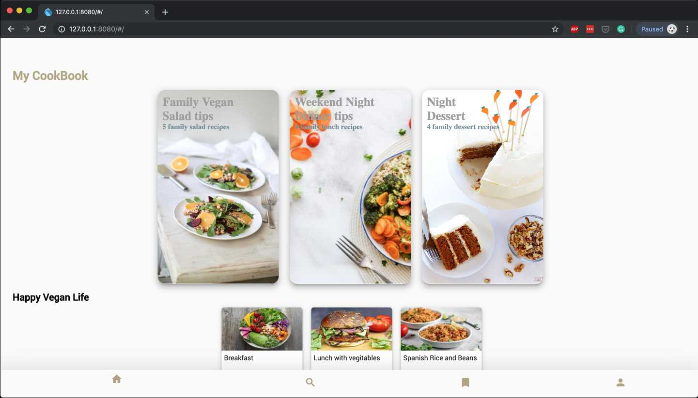
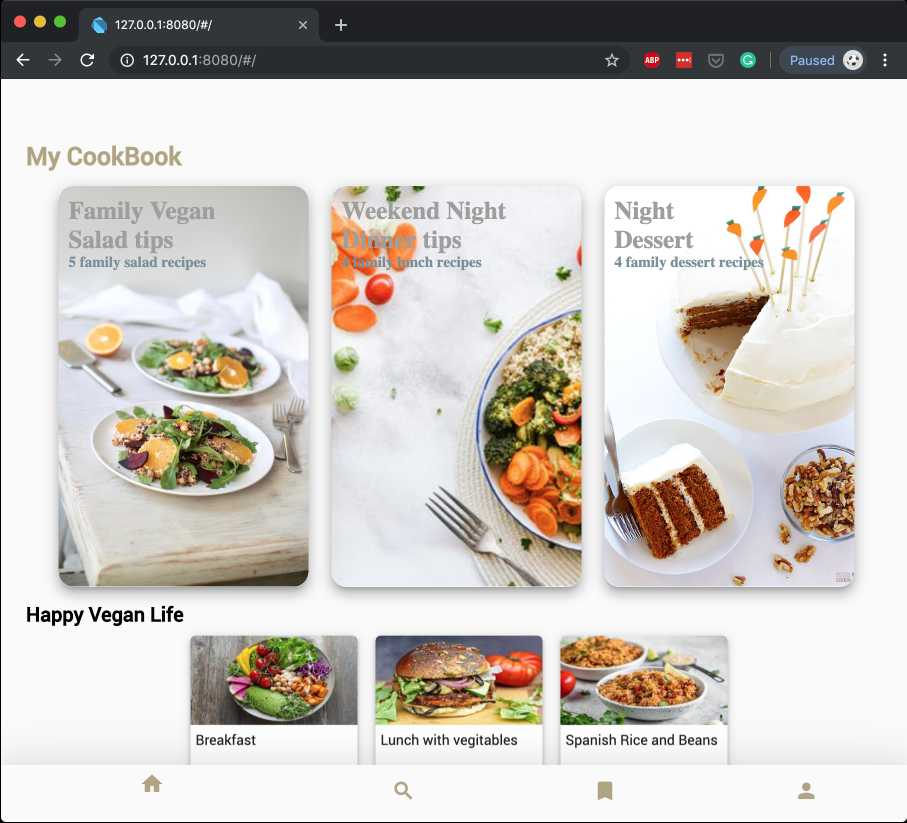
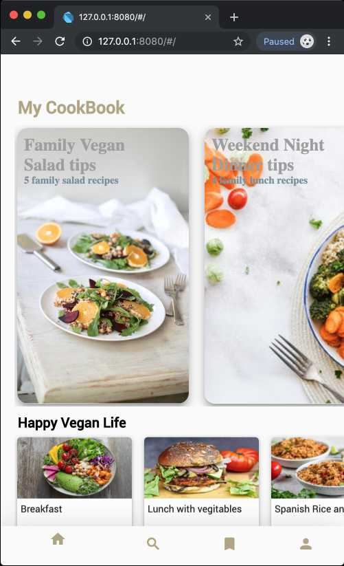

# hello_food_web

Check [Flutter for web](https://flutter.dev/web) for more details

 For same UI in Android and iOS app, check this link
 [Hello Food Flutter App](https://github.com/shainsingh89/hello_food_new)

## Run the sample 
 To run this you can check the this 
 [Link](https://github.com/flutter/flutter_web)
 
 or 
 
 ### Install the flutter_web build tools
 
 To install the
 [`webdev` package](https://pub.dartlang.org/packages/webdev),
 which provides the build tools for Flutter for web, run the following:
 
 ```console
 $ flutter pub global activate webdev
 ```
 
 Ensure that the `$HOME/.pub-cache/bin` directory
 [is in your path](https://www.dartlang.org/tools/pub/cmd/pub-global#running-a-script-from-your-path),
 and then you may use the `webdev` command directly from your terminal.
 
 > Note: if you have problems configuring `webdev` to run directly, try:<br>
   `flutter pub global run webdev [command]`.
 
 ### Run the hello_food example
 
1.  Go to project directory
 
     ```console
     $ cd hello_food/
     ```
 
 2. Update packages.
 
     ```console
     $ flutter pub upgrade
     ! flutter_web 0.0.0 from path ../../flutter_web
     ! flutter_web_ui 0.0.0 from path ../../flutter_web_ui
     Running "flutter pub upgrade" in hello_world...                5.0s
     ```
 
     If that succeeds, you're ready to run it!
 
 3. Build and serve the example locally.
 
     ```console
     $ webdev serve
     [INFO] Generating build script completed, took 331ms
     ...
     [INFO] Building new asset graph completed, took 1.4s
     ...
     [INFO] Running build completed, took 27.9s
     ...
     [INFO] Succeeded after 28.1s with 618 outputs (3233 actions)
     Serving `web` on http://localhost:8080
     ```
 
     Open <http://localhost:8080> in Chrome and you should see `Hello
     Food` in red text in the upper-left corner.
     
 
 ## Sample Images
 
 



